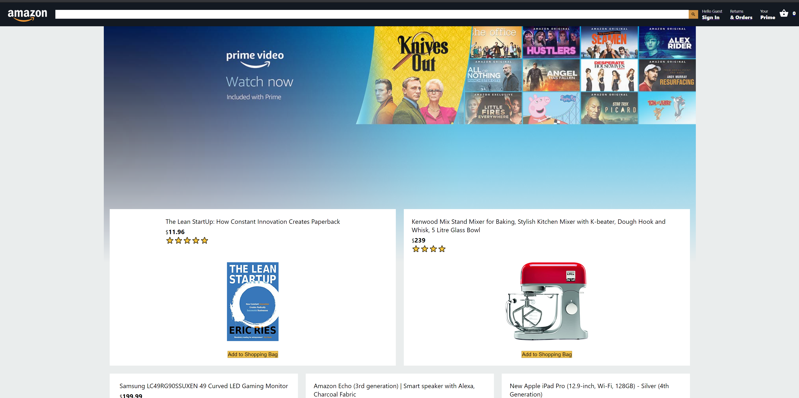

# Notmazon App

### What I built

> A mega store type e-commerce site based of the Amazon website. It has users, db & cloud functions with Firebase. Stripe is integrated to the app making it posible to accept credit crd payments.

### Project screenshot




### 📝 Setup

 - Open a terminal
 
 - Clone this code: 
        ```
        git clone https://github.com/jurgen1c/react-mega-store.git
        ```

- Run the command ```npm install``` from root directory to install the app dependencies.

- Run the command ```npm run start```.


### Build With

- HTML
- JavaScript
- React
- SASS  

### Check out the live demo [here](https://my--clone-6f40a.web.app/)     

## 👤 Author


👤 **Jurgen Clausen Gutierrez**

- Github: [@jurgen1c](https://github.com/jurgen1c)
- LinkedIn: [jurgen-clausen](https://www.linkedin.com/in/jurgen-clausen-2740061a9/)

## 🤝 Contributing

Contributions, issues and feature requests are welcome!

Feel free to check the [issues page](issues/).

## Show your support

Give a ⭐️ if you like this project!

## Acknowledgments

- React
- etc